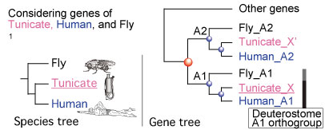
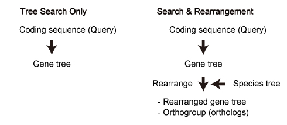
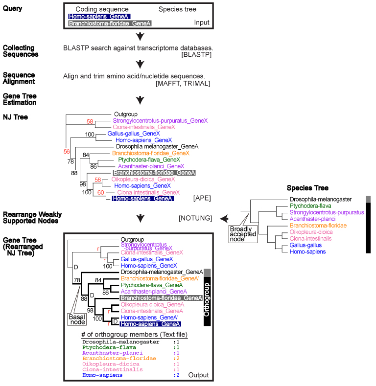
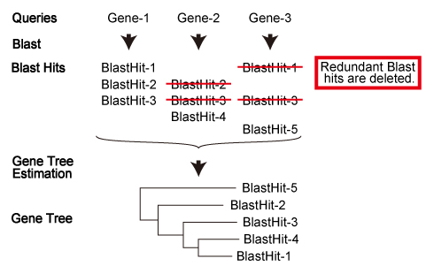
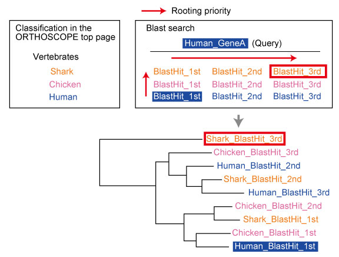
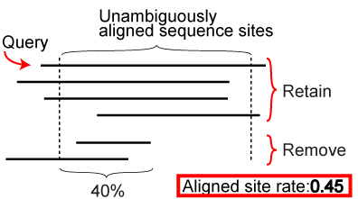

# ORTHOSCOPE

<!-- 
---

## NEWS
Mirror viento has been accidentally stopped on 19 Jan 2024 morning. Please use Mirror Osaka until recovery of viento.

---
-->

## Mirror sites for analyses
viento (fast)  
[https://orthoscope.jp/orthoscope/Deuterostomia.html](https://orthoscope.jp/orthoscope/Deuterostomia.html)

<!-- 
yurai  
Under construction
[http://yurai.aori.u-tokyo.ac.jp/orthoscope/Deuterostomia.html](http://yurai.aori.u-tokyo.ac.jp/orthoscope/Deuterostomia.html) 
-->

Osaka   
[http://133.167.86.72/orthoscope/Deuterostomia.html](http://133.167.86.72/orthoscope/Deuterostomia.html)

<!--
OIST   
[https://fish-evol.unit.oist.jp/orthoscope/Deuterostomia.html](https://fish-evol.unit.oist.jp/orthoscope/Deuterostomia.html)
-->  

---

## Abstract   
<table width="100%" border="0" cellspacing="0" cellpadding="0">
<tr>
<td width="55%">
<div align="left">
ORTHOSCOPE (<a href="https://academic.oup.com/mbe/article/36/3/621/5229933" target="_blank">Inoue and Satoh 2019</a>) is a web tool to identify orthogroup members (orthologs and paralogs, see below) of a specific protein-coding gene of animals and plants. By uploading gene sequences of interest and by selecting species genomes from >600 animals/plants, users can infer their functions and copy numbers, according to results reported by ORTHOSCOPE in the form of gene trees.
<br><br>
By using sequences collected by the BLAST search, ORTHOSCOPE estimates the gene tree, compares it with the <a href="https://github.com/jun-inoue/Species_tree" target="_blank">species tree</a>, and identifies an orthogroup.
<br><br>
ORTHOSCOPE works only for a specific molecule and does not allow genome-scale analyses. Recently I developed the downloaded version, <a href="https://github.com/jun-inoue/ORTHOSCOPE_STAR" target="_blank">ORTHOSCOPE*</a> (star). This analytic pipeline accommodates genome-wide data of protein-coding genes and infers genome-scale events.
</div>
</td>
<td width="45%">

</td>

<tr valign="top">
<td>
<b>Japanese instruction (日本語の説明):</b><br>
<a href="http://www.fish-evol.org/orthoscope_ji.html" target="_blank">http://www.fish-evol.org/orthoscope_ji.html</a><br>
<b>Togo TV (日本語の動画):</b><br>
<a href="https://togotv.dbcls.jp/20220815.html" target="_blank">https://togotv.dbcls.jp/20220815.html</a><br>
</td>
<td>
<b>Genome wide analayses:</b><br>
<a href="https://github.com/jun-inoue/ORTHOSCOPE_STAR" target="_blank">https://github.com/jun-inoue/ORTHOSCOPE_STAR</a><br>
<b>non-coding analyses:</b><br>
<a href="https://github.com/jun-inoue/dbCNS" target="_blank">https://github.com/jun-inoue/dbCNS</a><br>
</td>
</tr>
</table>


---

## Slides   
[](http://www.fish-evol.org/NewFiles/ORTHOSCOPE_slides3.pdf)

---

## Orthogroup   
A set of genes descended from a single gene in the last common ancestor of all the species being considered (<a href="https://genomebiology.biomedcentral.com/articles/10.1186/s13059-015-0721-2" target="_blank">Emms and Kelly 2015</a>). <br>



---

## Mode


---

## Flow Chart


Dependencies:   
[BLAST 2.7.1+](https://blast.ncbi.nlm.nih.gov/Blast.cgi?CMD=Web&PAGE_TYPE=BlastDocs&DOC_TYPE=Download)   
[MAFFT v7.356b](https://mafft.cbrc.jp/alignment/software/)   
[trimAl 1.2rev59](http://www.fish-evol.org/trimAl_ji.html)   
[PAL2NAL v13](http://www.bork.embl.de/pal2nal/)   
[ape in R, Version5.0](http://ape-package.ird.fr)   
[FastME 2.0](http://www.atgc-montpellier.fr/fastme/) for amino acid analyses   
[Notung-2.9](http://www.cs.cmu.edu/~durand/Notung/)   

---

## Broadly Accepeted Nodes Used in Focal Analyses  
Focal analysis | Broadly Accepeted Nodes | 
--- | --- 
Actinopterygii |  Teleostomi, Gnathostomata, or Vertebrata   
Mammalia |  Amniota, Tetrapoda, or Sarcopterygii  
Vertebrata | Olfactore, Chordata, or Deuterostomia  
Deuterostomia |  Nephrozoa or Bilateria  
Protostomia |  Nephrozoa or Bilateria  
Acropora |  Scleractinia, Anthozoa, or Cnidaria
Plants |  Mesangiospermae  

---

## Use of Query Sequences in Gene Tree Estimation   
### Redundant Blast hits are deleted   


### Queries are added or replaced   


---

## Example Data   
### Ishikawa et al (2019)   
Ishikawa, A, et al. 2019. A key metabolic gene for recurrent freshwater colonization and radiation in fishes. Science, 364: 886-9. [Link](https://science.sciencemag.org/content/364/6443/886).    

[Queries](http://yurai.aori.u-tokyo.ac.jp/orthoscope/examples/ActinopterygianFads2.fas.txt).    
[Taxon sampling](http://yurai.aori.u-tokyo.ac.jp/orthoscope/examples/taxon_sampling_Actinopterygii.txt.zip).    
To count Fads2 gene copies, these sequences were used for "Comparing gene and species trees" mode of "Focal group Actinopterygii".    


#   
### Inoue et al (2019)   
<table width="100%" border="0" cellspacing="2" cellpadding="0">
<tr valign="top">
<td width="60%">
<div align="left">
Inoue J, Nakashima K, and Satoh N. 2019. ORTHOSCOPE analysis reveals the presence of the cellulose synthase gene in all tunicate genomes but not in other animal genomes. Genes. 10: 294. <a href="https://www.mdpi.com/2073-4425/10/4/294" target="_blank">Link</a><br>

<br>
<a href="https://github.com/jun-inoue/orthoscope/raw/master/tarfiles/CesA_Satoh19.zip" target="_blank">Queries</a><br>
For queries, CesA gene sequences were separated into 2 parts: CesA (before TM7) and GH6 (after TM7]) domains.<br>
<a href="http://yurai.aori.u-tokyo.ac.jp/orthoscope/examples/taxon_sampling_Inoue19CesA.txt.zip" target="_blank">Taxon sampling</a><br>
In this paper, maximum likelihood trees were estimated according to the process described in "Tree Estimation of Orthogroup Members (with Additional Sequences)". See below.   
</div>
</td>
<td width="40%">

</td>
</tr>
</table>


#   
### Inoue and Satoh (2019)
Inoue J. and Satoh N. 2019. ORTHOSCOPE: an automatic web tool of analytical pipeline for ortholog identification using a species tree. 36:621–631. [Link](https://academic.oup.com/mbe/article/36/3/621/5229933).   

| Actinopterygii | Vertebrata | Deuterostomia | Protostomia |
:---: | :---: | :---: | :---:
| PLCB1* | ALDH1A* | Brachyury | Brachyury |
| [Queries][t1-1] | [Queries][t1-2] | [Queries][t1-3] | [Queries][t1-4] |
| [Result][t1-5] | [Result][t1-6] | [Result][t1-7] | [Result][t1-8] |

[t1-1]:https://github.com/jun-inoue/orthoscope/raw/master/tarfiles/ActinopterygianPLCB1.fas
[t1-2]:https://github.com/jun-inoue/orthoscope/raw/master/tarfiles/VertebrateALDH1A.fas
[t1-3]:https://github.com/jun-inoue/orthoscope/raw/master/tarfiles/DeuterostomeBra.fas
[t1-4]:https://github.com/jun-inoue/orthoscope/raw/master/tarfiles/ProtostomeBra.fas
[t1-5]:https://github.com/jun-inoue/orthoscope/raw/master/tarfiles/ActinopterygianPLCB1.zip
[t1-6]:https://github.com/jun-inoue/orthoscope/raw/master/tarfiles/VertebrateALDH1A.zip
[t1-7]:https://github.com/jun-inoue/orthoscope/raw/master/tarfiles/DeuterostomeBra.zip
[t1-8]:https://github.com/jun-inoue/orthoscope/raw/master/tarfiles/ProtostomeBra.zip


#   
### Downloading query sequences from NCBI/Ensembl
From [NCBI](https://www.ncbi.nlm.nih.gov) or [Ensembl](http://ensembl.org/index.html), query sequences can be downloaded.   
For coding sequneces, please select CDS as follows.

[](images/CDSselectL.jpg)   


#   
### Collecting Query Sequences from an Assemble Database (Vertebrate ALDH1A and Actinopterygin PLCB1)

1. Download Coregonus lavaretus TSA file ([GFIG00000000.1](https://www.ncbi.nlm.nih.gov/nuccore/GFIG00000000.1)) form NCBI.
2. Translate raw sequences into amino acid and coding sequences using [TransDecoder](https://github.com/TransDecoder/TransDecoder/wiki).
```
./TransDecoder.LongOrfs -t GFIG01.1.fsa_nt
```
3. Make blast databases using [BLAST+](https://blast.ncbi.nlm.nih.gov/Blast.cgi?CMD=Web&PAGE_TYPE=BlastDocs&DOC_TYPE=Download).
```
makeblastdb -in longest_orfs.pep -dbtype prot -parse_seqids 
makeblastdb -in longest_orfs.cds -dbtype nucl -parse_seqids
```
4. BLASTP seaech against amino acid database.
```
blastp -query query.txt -db longest_orfs.pep -num_alignments 10 -evalue 1e-12 -out 010_out.txt
```
5. Retrieve blast top hit sequences from coding sequence file using sequence id.
```
blastdbcmd -db longest_orfs.cds -dbtype nucl -entry_batch queryIDs.txt -out 020_out.txt
```

<br />
<br />

---
## Focal Group


<br />
<br />  

---
## Upload Files
Coding sequence


Case 1: Query seqeunce is present in the ORTHOSCOPE database


Case 2: Query seqeunce is not present in the ORTHOSCOPE database


<br />
<br />  

---
## Rooting Selection from Blast Hits



<br />
<br />  

---
## Species Tree Hypothesis


See our [Species_tree](https://github.com/jun-inoue/Species_tree) page.

---
## Sequence Collection


<br />
<br />  

---
## Aligned Site Rate


<br />
<br />  

---
## Tree Search
Dataset


<br />
Rearrangement BS value threshold 


NJ analysis is conducted using the software package [Ape](https://cran.r-project.org/web/packages/ape/ape.pdf) in R (coding) and [FastME](http://www.atgc-montpellier.fr/fastme/) (amino acid). Rearrangement analysis is done using a method implemented in [NOTUNG](http://www.cs.cmu.edu/~durand/Notung/).

<br />
<br />  

---
## Genome Taxon Sampling

To reduce computational burden, "Number of species" is restricted.    
For example, if a user selected "Number of hits to report per genome" as 3, "Number of species" should be less than 50 spp.

Number of hits to report per genome | Number of species
:---: | :---:
3 | <120
5 | <70 
10 | <50 

<br />
<br />  

---
## Tree Estimation of Orthogroup Members (with Additional Sequences)
By using sequences of ORTHOSCOPE results, the analysis can be done on your own computer.  
I made an analysis pipeline for this 2nd step. The script is specialized for a Macintosh use with Python 3. Windows users need some modifications.  
Analysis pipeline with example data: [DeuterostomeBra_2ndAnalysis.zip](https://github.com/jun-inoue/orthoscope/raw/master/tarfiles/DeuterostomeBra_2ndAnalysis.zip).

### Installing Dependencies

Estimation of the 2nd tree by the downloaded pipeline requires some dependencies to be installed and in the system path in your computer.
<br />  


#### RAxML:

Available here: [https://github.com/stamatak/standard-RAxML](https://github.com/stamatak/standard-RAxML)

Download the the latest release and extract it.
Cd into the extracted directry (e.g., standard-RAxML-8.2.12), compile the PThreads version, and copy the executable to a directory in your system path, e.g.:
```
cd standard-RAxML-8.2.12
make -f Makefile.SSE3.PTHREADS.gcc
cp raxmlHPC-PTHREADS-SSE3 ~/bin
```
Add the address to your PATH. For example:
```
export PATH=$PATH:~/bin
``` 
<br />  

#### Mafft v7.407:
Available here: [https://mafft.cbrc.jp/alignment/software/](https://mafft.cbrc.jp/alignment/software/).  
After compilation, set your PATH following [this site](https://mafft.cbrc.jp/alignment/software/add_path.html).  

<br />   


#### trimAl v1.2 (Official release):
Available here: [http://trimal.cgenomics.org/downloads](http://trimal.cgenomics.org/downloads).  
Cd to trimAl/source, type make, and copy the executable.
```
make
cp trimal ~/bin
```  
<br />  


#### pal2nal.v14: 
Available here: [http://www.bork.embl.de/pal2nal/#Download](http://www.bork.embl.de/pal2nal/#Download).  
Change the permission of perl script and copy it.
```
chmod 755 pal2nal.pl
cp pal2nal.pl ~/bin
```  
<br />  


#### Ape in R:
R (3.5.2) is available from [here](https://cran.ism.ac.jp).  
By installing R, [rscript](https://stat.ethz.ch/R-manual/R-devel/library/utils/html/Rscript.html) will be installed automatically.  
[APE in R](http://ape-package.ird.fr) can be installed from the R console as follows:
```
install.packages("ape")
```
<br />
<br />  

### Tree Estimation

Using the downloaded pipeline, the 2nd gene trees will be estimated as follows:
- Based on the estimated rearranged NJ tree, users should select coding sequences of orthogroup and outgroups manually. Then the pipeline can start subsequent analyese.
- Selected sequences are aligned using MAFFT (Katoh et al. 2005). 
- Multiple sequence alignments are trimmed by removing poorly aligned regions using TRIMAL 1.2 (Capella-Gutierrez et al. 2009) with the option “gappyout.” 
- Corresponding cDNA sequences are forced onto the amino acid alignment using PAL2NAL (Suyama et al. 2006) to generate nucleotide alignments. 
- Phylogenetic analysis is performed with RAxML 8.2.4 (Stamatakis et al. 2014), which invokes a rapid bootstrap analysis and searches for the best-scoring ML tree with the GTRGAMMA (Yang 1994a, 1994b) or GTRCAT model. 

The actual rocess is as follows:   

1. Decompress DeuterostomeBra_2ndAnalysis.zip. Open DeuterostomeBra_2ndAnalysis file and decompress 100_2ndTree.tar.gz file.

2. Select an appropriate outgroup and orthogroup members and save 010_candidates_nucl.txt file. The outgroup sequence should be placed at the top of alignment. Additional sequences can be included.

[](images/treeSearchWithOrthologs2L.jpg)

3. Cd into 100_2ndTree directory.
4. Run the pipeline.
```
./100_estimate2ndTree.py
```
5. ML tree is saved in 200_RAxMLtree_Exc3rd.pdf automatically.

[](images/200_RAxMLtree_Exc3rdL.jpg)

<br />  


### Duplicated Node Estimation
Using [Notung](http://www.cs.cmu.edu/~durand/Notung/), duplicated nodes can be identified. Here, we will analyze the gene tree of orthogroup members.

1. Double click the downloaded .jar file (here, Notung-2.9.jar).  
2. Save the species tree (newick format) as a new file (here, speciesTree.tre), from 000_summary.txt file.  
3. Open the species tree file, speciesTree.tre (File > Open Gene Tree), from Notung.  
4. Open the gene tree file, RAxML_bootstrap.txt (File > Open Gene Tree).  
5. Set "Edge Weight THreshold" (here 70) from “Edit Values button“. This value corresponds to
“Rearrangement BS value threshold” in ORTHOSCOPE.  
6. From "Rearrange" tab in the bottum, select "Prefix of the general label".  
7. Push "Reconcile" button.  
8. Duplicated nodes are shown with "D".  

[](images/Notung_rearrangement1L.jpg)

<br />
<br />  
 


---
## Supported Browsers
Chrome | Firefox | Safari | IE
:---: | :---: | :---: | :---:
Supported | Supported | 11.0 or later | Not supported
<br />
<br />  

---
## History

Date | Version | Revision
--- | --- | ---
1 Feb. 2024 |  | Data of seven teleosts (Coregonus clupeaformis, Salmo trutta, Salvelinus namaycush, Oncorhynchus nerka, Oncorhynchus gorbuscha, Oncorhynchus keta, Cololabis saira) were newly added.
31 Jan. 2024 |  | Data of a perl oyster (Chromosome-scale, haplotype-phased genome assembly) were newly added.
28 Jan. 2024 |  | Data of a conger eel (Conger conger) and a confer (Cryptomeria japonica) were newly added.
24 Aug. 2023 |  | Data of a rayfinned fish (Amia calva) were newly added.
23 Apr. 2023 |  | Data of a coral (Pocillopora damicornis) were newly added.
21 Jan. 2023 |  | Data of two ferns (Marsilea vestita and Ceratopteris richardii) were newly added.
18 Dec. 2022 |  | Data of a skate (Pristis pectinata) were newly added.
28 Aug. 2022 |  | Data of Maidenhair tree (Ginkgo biloba), two ferns (Azolla filiculoides and Salvinia cucullata), and gymnosperms (Ginkgo biloba, Cycas-micholitzii, Gnetum-montanum, Taxus-baccata, Pseudotsuga-menziesii, Picea-glauca, and Pinus sylvestris) were newly added.
9 Aug. 2022 |  | Data of a hornworts (Anthoceros angustus), liverworts (Marchantia polymorpha, Male Tak1 and Male and femele) were newly added.
9 Aug. 2022 |  | Data of a basal streptophyte alga (Penium-margaritaceum) were newly added.
2 Jul. 2022 |  | Data of two plants (Leersia perrieri and Camelina sativa) were newly added.
2 Jul. 2022 |  | Data of two sharks (C.plagiosum and S.fasciatum) and 5 plants (Brachypodium.distachyon, Hordeum.vulgare, Secale.cereale, Aegilops.tauschii, Triticum.spelta, and Actinidia.chinensis) were newly added.
9 Jun. 2022 |  | Data of an sweet orange were newly added.
22 May 2022 | Version 1.5.2 | Bug fix release: In result pages derived from "Comparing gene and species trees" mode, query replacements are shown. Amino Acide analyses were fixed by limiting character numbers of name lines up to 60. Sorry, this problem has been left for several months.
19 May 2022 |  | New mirror site, AORI:viento, is added.
18 Dec. 2021 |  | Data of a sea urchin (Lytechinus) and 3 crustaceans (Penaeus japonicus, Homarus, and Portunus) were newly added.
11 Dec. 2021 |  | Data of 2 ancient fishes (Polypterys, Polyodon) were newly added.
14 Aug. 2021 |  | Data of 4 liliopsid data (e.g., Dioscorea, Asparagus, Zingiber, and Ananas) were newly added.
13 Aug. 2021 |  | Data of 7 fabales (e.g., Glycine-max) were newly added.
25 Jul. 2021 |  | Data of Carcharodon carcharias (Great white shark ) was newly added.
21 Jul. 2021 |  | Data of Caulerpa lentillifera (Siphonous green alga) was newly added.
19 Jun. 2021 |  | Data of seven plants (EnsPlant51) were newly added.
10 Apr. 2021 | Version 1.5.1 | Released. A focal group, Plants, was newly added.
11 Feb. 2021 |  | Data of a shirmp (Penaeus monodon) and an tunicate (Styela clava) were newly added. 
6 Feb. 2021 |  | Data of 2 sharks (Callorhinchus-milii-E102 and Scyliorhinus-canicula) and 18 teleosts (e.g. Hucho-hucho) were newly added. 
5 Feb. 2021 |  | Data of 6 Oryzias individualds (Oryzias melastigma E102, O.javanicas, O.sinensis, O.latipes HSOK, HNI, HdrR E102) were newly added. 
1 Feb. 2021 |  | Data of 2 asteroids (Asterias rubens and Patiria miniata [RefSeq]) and a lancelet (Branchiostoma lanceolatum [Ensembl]) were newly added.
29 Dec. 2020 | Version 1.5.0 | Text areas were introduced for sequence uploading. In conjunction with the renewal, the file uploading system was closed.
24 Dec. 2020 |  | Gene model data were newly added for 4 snakes (Pantherophis guttatus, Thamnophis elegans, Naja naja, and Laticauda laticaudata). 
6 Dec. 2020 | Version 1.2.2 | Gene model data were newly added for 3 sharkes (Scyliorhinus torazame, Chiloscyllium punctatum, and Rhincodon typus), human (Homo sapiens Ens102), and chicken (Gallus gallus Ens102). 
6 Sep. 2020 | Version 1.2.1 | Gene model data were newly added for an echinoderm (Anneissia japonica) and replaced with TSA data for an acoela (Hofstenia-miamia). 
30 Aug. 2020 |  | Data of Sterlet (Acipenser ruthenus) and  European eel (Anguilla anguilla) were newly added.
1 Jun. 2020 | Version 1.2.0 | Released. A focal group, Acropora, was newly added.
1 Jun. 2020 | Version 1.1.0 | Released. Data of Amblyraja radiata (Thorny skate) was newly added.
14 Jan. 2020 |  | The batch uploading was implemented for taxon sampling.
6 Nov. 2019 |  | ORTHOSCOPE-Mammalia was newly created and data of 46 mammals were newly added.
2 Oct. 2019 |  | Data of Pacific white shrimp (Penaeus vannamei) were newly added.
5 Sep. 2019 |  | Data of 2 molluscs (Octopus vulgaris, Pomacea canaliculata) were newly added.
21 Aug. 2019 |  | Column of Seqs (# of sequence in each gene model) was added.
21 Aug. 2019 |  | Data of 6 actinopterygians (Erpetoichthys calabaricus, Denticeps clupeoides, Carassius auratus, Electrophorus electricus,Tachysurus fulvidraco, Pangasianodon hypophthalmus), 2 amphibians (Rhinatrema bivittatum, Microcaecilia unicolor), and 3 lepidosaurians (Notechis scutatus, Podarcis muralis, Pseudonaja textilis) were newly added.
19 Apr. 2019 |  | Nagative branch lengths are replaced with 0 in the tree drawing (R script). Gene_tree$edge.length[Gene_tree$edge.length<0]<-0
25 Jan. 2019 | Version 1.0.2 | Released. For Inoue et al. 2019, Data of Archaea, Plants, Bacteria, and Urochordata were newly added.
21 Dec. 2018 | Version 1.0.1 | Released. In the rearranged gene tree, nodes identified as speciation events were marked with "D".
18 Dec. 2018 | Version 1.0.1.beta | Xenacoelomorph, platyhelminth, priapulid, avian data were newly added.
10 July 2018 | Version 1.0 | Published in Inoue and Satoh (2018).

<br />
<br />  

---
## Gene Model Databases of ORTHOSCOPE
ORTHOSCOPE employs a genome-scale protein-coding gene database (coding and amino acid sequence datasets) constructed for each species. In order to count numbers of orthologs in each species, only the longest sequence is used when transcript variants exist for single locus.

29 Dec. 2020   
From ver. 1.5.0, each gene model can be downloaded by clicking p (amino acid sequence) or n (coding sequence) in at the right of each species line. 

6 Oct. 2019   
Gene model databases (fasta files of amino acid and coding sequences) can be downloaded from [zenodo](https://zenodo.org/record/3547154#.Xe2zeC3AMvo) (10.5281/zenodo.2553737).     

<br />
<br />  

---
## Papers using ORTHOSCOPE
Ishikawa, A, Kabeya, N, Ikeya, K, Kakioka, R, Cech, JN, Osada, N, Leal, MC, Inoue J, Kume, M, Toyoda, A, Tezuka, A, Nagano, AJ, Yamasaki, YY, Suzuki, Y, Kokita, T, Takahashi, H, Lucek, K, Marques, D, Takehana, Y, Naruse, K, Mori, S, Monroig, O, Ladd, N, Schubert, C, Matthews, B, Peichel, CL, Seehausen, O, Yoshizaki, G, Kitano J. 2019.
A key metabolic gene for recurrent freshwater colonization and radiation in fishes. Science, 364: 886-9. [Link](https://science.sciencemag.org/content/364/6443/886).
<blockquote>
By counting the number of gene copies in 48 actinopterygians, ORTHOSCOPE found that Fads2 gene (involved in fatty acid desaturation) was duplicated in freshwater species.
</blockquote>
<br />

Inoue J, Nakashima K, Satoh, N. 2019.
ORTHOSCOPE analysis reveals the presence of the cellulose synthase gene in all tunicate genomes but not in other animal genomes. Genes. 10: 294. [Link](https://www.mdpi.com/2073-4425/10/4/294)
<blockquote>
By showing the absence of CesA gene in protostomes and basal deuterostomes, ORTHOSCOPE confirmed that the prokaryotic cellulose synthase gene (CesA) was horizontally transferred into the genome of a tunicate ancestor.
</blockquote>
<br />

Shiraishi A, Okuda T, Miyasaka N, Osugi T, Okuno Y, Inoue J, and Satake H. 2019.
Repertoires of G protein-coupled receptors for Ciona-specific neuropeptides. Proceedings of the National Academy of Sciences of the United States of America.  116: 7847-7856. [Link](https://www.pnas.org/content/early/2019/03/28/1816640116)
<blockquote>
This paper identified multiple G protein-coupled receptors (GPCRs) for species-specific neuropeptides of Ciona intestinalis. By reconstructing gene trees, ORTHOSCOPE showed that these GPCRs are evolutionarily unrelated to any other known peptide GPCRs.
</blockquote>
<br />

Yasuoka Y, Matsumoto M, Yagi K, Okazaki Y. 2019. 
Evolutionary History of GLIS Genes Illuminates Their Roles in Cell Reprograming and Ciliogenesis. Molecular Biology and Evolution 37:100-109.
<blockquote>
The GLIS family transcription factors, GLIS1 and GLIS3, potentiate generation of induced pluripotent stem cells (iPSCs), although another GLIS family member, GLIS2, suppresses cell reprograming. Using ORTHOSCOPE, Yasuoka et al. showed that GLIS1 and GLIS3 originated during vertebrate whole genome duplication, whereas GLIS2 is a sister group to GLIS1/3. This study clearly indicates that as the first step, future reprograming studies should focus on GLIS1/3 rather than on GLIS2.
</blockquote>
<br />

Inoue J, Satoh N. 2018.
Deuterostome genomics: Lineage-specific protein expansions that enabled chordate muscle evolution. Molecular Biology and Evolution. 35(4):914-924.　[Link](https://academic.oup.com/mbe/article/35/4/914/4793229)
<blockquote>
The pipeline implemented in ORTHOSCOPE was used to evaluate the presence or absence of genes coding for structural-muscle proteins.
</blockquote>
<br />

Inoue J, Yasuoka Y, Takahashi H, Satoh N. 2017.
The chordate ancestor possessed a single copy of the Brachyury gene for notochord acquisition. Zoological Letters. 3: 4.　[Link](https://zoologicalletters.biomedcentral.com/articles/10.1186/s40851-017-0064-9)
<blockquote>
  The pieline implemented in ORTHOSCOPE was used to count the number of Brachury gene in 5 deuterostome lineages.  
</blockquote> 

<br />
<br />  

---
## Citation
Inoue J. and Satoh N. 2019. ORTHOSCOPE: An automatic web tool for phylogenetically inferring bilaterian orthogroups with user-selected taxa. Molecular Biology and Evolution, 36, 621–631. [Link](https://academic.oup.com/mbe/advance-article/doi/10.1093/molbev/msy226/5229933).

---
## Contact 
Email: [_jinoueATg.ecc.u-tokyo.ac.jp_](http://www.fish-evol.org/index_eng.html)
