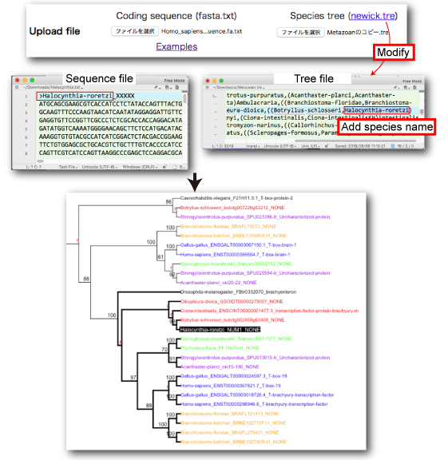

# ORTHOSCOPE
Our web servise is available from 
http://orthoscope.jp

---

## Mode


---

## Case studies in Inoue and Satoh (submitted).
Query seqeunces from genes with known function.

| Actinopterygii | Vertebrata | Deuterostomia | Protostomia |
:---: | :---: | :---: | :---:
| PLCB1* | ALDH1A* | Brachyury | Brachyury |
| [Queries][t1-1] | [Queries][t1-2] | [Queries][t1-3] | [Queries][t1-4] |
| [Result][t1-5] | [Result][t1-6] | [Result][t1-7] | [Result][t1-8] |

[t1-1]:https://github.com/jun-inoue/orthoscope/raw/master/tarfiles/ActinopterygianPLCB1.fas
[t1-2]:https://github.com/jun-inoue/orthoscope/raw/master/tarfiles/VertebrateALDH1A.fas
[t1-3]:https://github.com/jun-inoue/orthoscope/raw/master/tarfiles/DeuterostomeBra.fas
[t1-4]:https://github.com/jun-inoue/orthoscope/raw/master/tarfiles/ProtostomeBra.fas
[t1-5]:https://github.com/jun-inoue/orthoscope/raw/master/tarfiles/ActinopterygianPLCB1.zip
[t1-6]:https://github.com/jun-inoue/orthoscope/raw/master/tarfiles/VertebrateALDH1A.zip
[t1-7]:https://github.com/jun-inoue/orthoscope/raw/master/tarfiles/DeuterostomeBra.zip
[t1-8]:https://github.com/jun-inoue/orthoscope/raw/master/tarfiles/ProtostomeBra.zip

#         
Query sequence collectoin from assemble database*

1. Download Coregonus lavaretus TSA file ([GFIG00000000.1](https://www.ncbi.nlm.nih.gov/nuccore/GFIG00000000.1)) form NCBI.
2. Translate raw sequences into amino acid and coding sequences using [TransDecoder](https://github.com/TransDecoder/TransDecoder/wiki).
```
./TransDecoder.LongOrfs -t GFIG01.1.fsa_nt
```
3. Make blast databases using [BLAST+](https://blast.ncbi.nlm.nih.gov/Blast.cgi?CMD=Web&PAGE_TYPE=BlastDocs&DOC_TYPE=Download).
```
makeblastdb -in longest_orfs.pep -dbtype prot -parse_seqids 
makeblastdb -in longest_orfs.cds -dbtype nucl -parse_seqids
```
4. BLASTP seaech against amino acid database.
```
blastp -query query.txt -db longest_orfs.pep -num_alignments 10 -evalue 1e-12 -out 010_out.txt
```
5. Retrieve blast top hit sequences from coding sequence file using sequence id.
```
blastdbcmd -db longest_orfs.cds -dbtype nucl -entry_batch queryIDs.txt -out 020_out.txt
```

<br />

---
## Analysis group


---
## Upload files
Coding sequence


Case 1: Query seqeunce is present in the ORTHOSCOPE database


Case 2: Query seqeunce is not present in the ORTHOSCOPE database



---
## Species tree hypothesis

Our hypothetical species tree (newick) can be downloaded from [here](https://fish-evol.unit.oist.jp/orthoscope/examples/SpeciesTreeHypothesis.tre).

<!--
| [Metazoa][treeA] | Hexapoda | [Vertebrata][treeC] | [Aves][treeD] | Actinopterygii |
:---: | :---: | :---: | :---: | :---:

[treeA]:https://github.com/jun-inoue/orthoscope/raw/master/images/SpeciesTree_Metazoa.pdf
[treeD]:https://github.com/jun-inoue/orthoscope/raw/master/images/SpeciesTree_Aves.pdf
[treeC]:https://github.com/jun-inoue/orthoscope/raw/master/images/SpeciesTree_Vertebrata.pdf
-->

Phylogenetic relationships without references follow the [NCBI Taxonomy Common Tree](https://www.ncbi.nlm.nih.gov/Taxonomy/CommonTree/wwwcmt.cgi).

Newick formats can be modifed using [TreeGraph2](http://treegraph.bioinfweb.info/).


---
## Sequence collection


---
## Alignment


---
## Tree search
Dataset


<br />
Rearrangement BS value threshold 


NJ analysis is conducted using the software package [Ape](https://cran.r-project.org/web/packages/ape/ape.pdf) in R (coding) and [FastME](http://www.atgc-montpellier.fr/fastme/) (amino acid). Rearrangement analysis is done using a method implemented in [NOTUNG](http://www.cs.cmu.edu/~durand/Notung/).

---
## Genome taxon sampling

Feasibility of completion
Number of hits to report per genome | Number of species
:---: | :---:
3 | <50
5 | <40 
10 | <30


---
## Tree estimation of orthologs using additional sequences
The script is specialized for a Macintosh use. Windows users need some modifications.
[Example](https://github.com/jun-inoue/orthoscope/raw/master/tarfiles/DeuterostomeBra_2ndAnalysis.zip).

Dependencies:
[RAxML](https://sco.h-its.org/exelixis/web/software/raxml/index.html), [trimAl](http://trimal.cgenomics.org), [PAL2NAL](http://www.bork.embl.de/pal2nal/#Download), [R](https://cran.ism.ac.jp), [rscript](https://stat.ethz.ch/R-manual/R-devel/library/utils/html/Rscript.html), [APE in R](http://ape-package.ird.fr)


1. Select an appropriate outgroup and orthogroup members and save 010_candidates_nucl.txt file. The outgroup sequence should be placed at the top of alignment. Additional sequences can be included.

[](images/treeSearchWithOrthologsL.jpg)

2. Decompress 100_2ndTree.tar.gz file.
3. cd into 100_2ndTree file.
4. Run the pipeline.
```
./100_estimate2ndTree.py
```
5. ML tree is saved in 200_RAxMLtree_Exc3rd.pdf automatically.

[](images/200_RAxMLtree_Exc3rdL.jpg)

---
## Supported browsers
Chrome | Firefox | Safari | IE
:---: | :---: | :---: | :---:
Supported | Supported | 11.0 or later | Not supported

---
## History
10 July 2018 	Version 1.0.

---
## Database
Available from [here](https://zenodo.org/record/1452077#.W7xEfS_ANsM)
(10.5281/zenodo.1452077). 10 October 2018.

ORTHOSCOPE employs a genome-scale protein-coding gene database (coding and amino acid sequence datasets) constructed for each species. In order to count numbers of orthologs in each species, only the longest sequence is used, when transcript variants exist for single locus.

---
## Citation
Inoue J. and Satoh N. ORTHOSCOPE: an automatic web tool of analytical pipeline for ortholog identification using a species tree. in prep.

---
Previous versions: 


Email: [_jun.inoue_ AT _oist.jp_](http://www.geocities.jp/ancientfishtree/index_eng.html)
